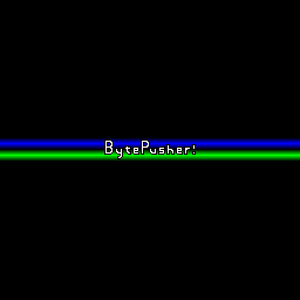
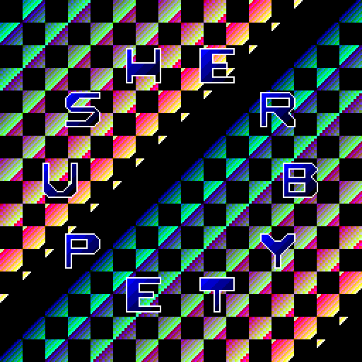

# BytePusher

A [Bytepusher][Bytepusher] virtual machine made with Zig and Raylib.

| | | |
|:-------------------------:|:-------------------------:|:-------------------------:|
|  |   |  |

## Usage

```
./bytepusher <rom-path>
```

## Keyboard

<table>
<tr><th>Keyboard</th><th>BytePusher VM</th></tr>
<tr><td>

|     |     |     |     |
|:-:|:-:|:-:|:-:|
| 1 | 2 | 3 | 4 |
| Q | W | E | R |
| A | S | D | F |
| Z | X | C | V |
</td><td>

|     |     |     |     |
|:-:|:-:|:-:|:-:|
| 1 | 2 | 3 | C |
| 4 | 5 | 6 | D |
| 7 | 8 | 9 | E |
| A | 0 | B | F |
</td></tr> </table>


[Bytepusher]: https://esolangs.org/wiki/BytePusher

<!-- todo -->

<!-- ref/links -->
